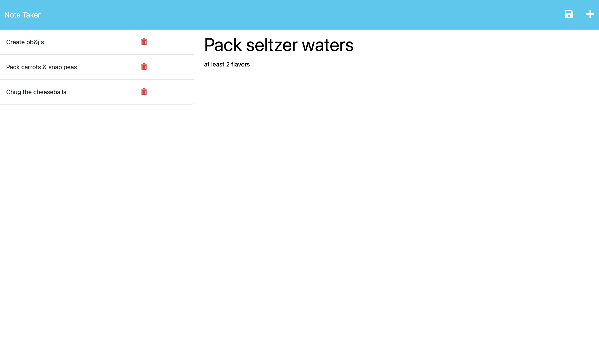

# Pen-to-Paper

## Note Taking Express.js Challenge

Pen-to-Paper is used to create a webpage that you can write, save, and delete notes.

## Usage

[Deployed application](https://tranquil-reaches-29344.herokuapp.com/)

## Contributors

Tutor help from:

- Matthew Calimbas

Consulting and guidance:

- Rachel Solov (TA)
- Lindsey Isaac
- Daniel Cohen

## License

MIT License
Copyright (c) 2023 jackieAmartinez
